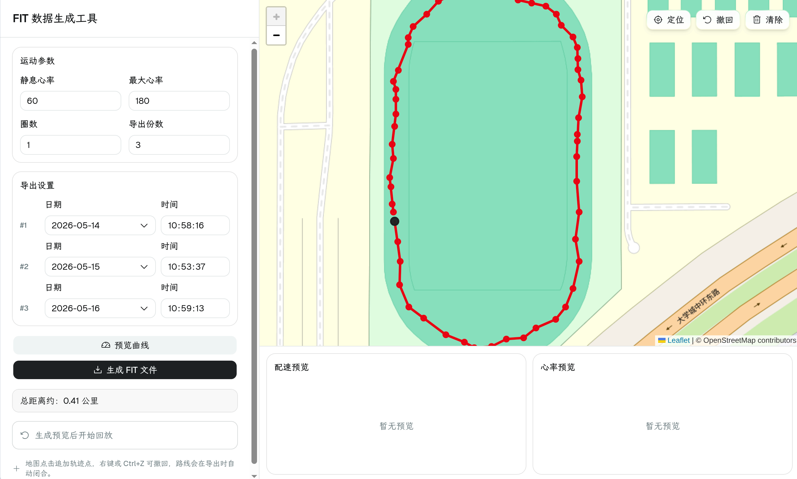

# Fake FIT

<p align="center">
  <strong>English</strong> | <a href="./README.zh-CN.md">中文</a>
</p>

Generate realistic FIT running files from a custom route drawn on the map.



## Features

- Draw a route on the map and export one or more FIT files.
- Customize start time, heart rate range, laps, and export count.
- Automatically saves the route locally to avoid losing it after refresh.
- Adds random timing, route start, path offset, speed, and heart-rate variation for more natural results.

## Development

```bash
pnpm install
pnpm run dev
```

## Build

```bash
pnpm run build
```

## Credits

- Built with React, Vite, shadcn/ui, Leaflet, Recharts, and Garmin FIT SDK.
- Inspired in part by the tool shown in the Bilibili video [keep可用的校园跑数据生成工具](https://www.bilibili.com/video/BV1ZfqUBoEFL/).

## License

[MIT](./LICENSE)
